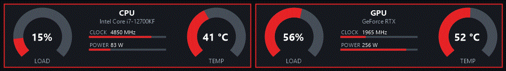

# HWiNFO Sensor Panel für WigiDash

Grafisches WigiDash-Widget für CPU-, GPU-, RAM-, VRAM-, Lüfter- und Netzwerkdaten. Das Widget unterstützt alle Rastergrößen von 1x1 bis 5x4. Außerhalb des WigiDash Managers wird eine animierte Demoquelle verwendet.

## Funktionen

- CPU- und GPU-Anzeige mit Last- und Temperatur-Gauges
- RAM-, VRAM-, Lüfter- und Netzwerk-Karten
- HWiNFO-Sensoren im Einstellungsmenü frei zuweisbar
- konfigurierbare Gauge-Farben und Warnschwellen
- Uhrzeit, Zeitzone, Uhrfarbe und Uhrgröße
- Touchaktionen für Header und externe WigiDash-Aktionen
- mehrere Seiten (Hardware und Home) mit Touch-Navigation ab Raster `3x2`
- Logo und Autorenhinweis `by ReXx09`

## Unterstützte Rastergrößen

Das Widget wird mit einer einzigen DLL für alle folgenden Rastergrößen registriert:

- Breite 1: `1x1`, `1x2`, `1x3`, `1x4`
- Breite 2: `2x1`, `2x2`, `2x3`, `2x4`
- Breite 3: `3x1`, `3x2`, `3x3`, `3x4`
- Breite 4: `4x1`, `4x2`, `4x3`, `4x4`
- Breite 5: `5x1`, `5x2`, `5x3`, `5x4`

Die Darstellung passt sich automatisch an die gewählte Größe an. Die allgemeine Plugin-Vorschau verwendet bewusst ein neutrales `2x2`-Panel. Kleine Raster zeigen eine kompakte Sensoranzeige, breite einzeilige Raster ein horizontales Panel. Das große `5x4`-Raster bleibt verfügbar, muss aber ausdrücklich als Rastergröße ausgewählt werden. Es bietet die vollständige CPU-/GPU-, RAM-, VRAM- und Netzwerkdarstellung und kann zwischen Last, Temperatur und kombinierter Gauge-Ansicht umgeschaltet werden.

## Seiten

Ab Raster `3x2` besteht das Widget aus mehreren Seiten, die per Touch gewechselt werden:

- **Hardware**: das Sensorpanel mit CPU, GPU, RAM, VRAM, Netzwerk und Lüftern (Standard).
- **Home**: Startseite mit vier konfigurierbaren Kacheln ab Raster `3x2`. Jede Kachel kann CPU, GPU, RAM, VRAM, Netzwerk, Lüfter, FPS oder Leer anzeigen.

Auf der Hardware-Seite führt der `HOME`-Button im Header zurück zur Startseite. Welche Seite nach dem Laden erscheint, wird im Einstellungsmenü unter **Seiten → Startseite** gewählt. Der Seitenwechsel reagiert nur auf einfaches Tippen. Kleinere Raster zeigen weiterhin nur das Sensorpanel.

Eine weitere Seite ergänzen:

1. Eintrag in `PanelPage` ([SensorSlot.cs](SensorSlot.cs)) hinzufügen.
2. Zeichenmethode schreiben und in der `switch`-Anweisung in `Draw` ([HwinfoPanelWidget.cs](HwinfoPanelWidget.cs)) eintragen.
3. In `DrawHomePage` eine Kachel zeichnen und mit `NavigateTo(...)` als Touch-Bereich registrieren.

## Voraussetzungen

- Windows mit installiertem WigiDash Manager
- .NET Framework 4.7.2 Developer Pack oder Visual Studio 2022 mit entsprechender Zielplattform
- HWiNFO, wenn echte HWiNFO-Messwerte verwendet werden sollen
- Zugriff auf die WigiDash-SDK-Datei `WigiDashWidgetFramework.dll`

Standardpfad der SDK-Datei:

`C:\Program Files (x86)\G.SKILL\WigiDash Manager\WigiDashWidgetFramework.dll`

## Bauen und installieren

PowerShell im Projektordner öffnen und zuerst den Debug- oder Release-Build ausführen:

```powershell
dotnet build .\HwinfoSensorPanel.csproj -c Release
```

Der Release-Build kopiert automatisch diese Dateien in den WigiDash-Widgetordner:

- die Widget-DLL `B4C9D6B1-3C75-4C27-8E8F-1D2DA1B8A4D3.dll`
- das Logo `IMG_0382.ico`

Standardziel:

`%APPDATA%\G.SKILL\WigiDashManager\Widgets\B4C9D6B1-3C75-4C27-8E8F-1D2DA1B8A4D3`

Falls der WigiDash Manager an einem anderen Ort installiert ist:

```powershell
dotnet build .\HwinfoSensorPanel.csproj -c Release `
	-p:WigiDashManagerPath="D:\Programme\WigiDash Manager"
```

Falls ein anderer Widget-Zielordner verwendet werden soll:

```powershell
dotnet build .\HwinfoSensorPanel.csproj -c Release `
	-p:WigiDashUserWidgetsPath="D:\WigiDashWidgets"
```

Nach dem Build den WigiDash Manager neu starten oder seine Widget-Liste aktualisieren. Ist der Manager während des Builds geöffnet und sperrt die DLL, ihn schließen und den Release-Build erneut starten.

## Installation prüfen

Nach einem erfolgreichen Release-Build müssen beide Dateien vorhanden sein:

```powershell
$target = "$env:APPDATA\G.SKILL\WigiDashManager\Widgets\B4C9D6B1-3C75-4C27-8E8F-1D2DA1B8A4D3"
Test-Path "$target\B4C9D6B1-3C75-4C27-8E8F-1D2DA1B8A4D3.dll"
Test-Path "$target\IMG_0382.ico"
```

Beide Befehle müssen `True` ausgeben. Anschließend das Widget im Manager hinzufügen oder eine vorhandene Instanz neu laden.

## Sensoren verwenden

Im Einstellungsmenü des Widgets lassen sich die passenden CPU-, GPU-, RAM-, Lüfter- und Netzwerksensoren auswählen. Für echte Werte müssen HWiNFO und die Sensorintegration des WigiDash Managers aktiv sein. Ohne Manager beziehungsweise ohne verfügbare Sensorquelle zeigt das Widget Demo-Werte.

## Demo-Animation



Die Demoquelle [`DemoSensorSource`](DemoSensorSource.cs) erzeugt kontinuierlich wechselnde Last-, Temperatur-, Takt-, Leistungs- und Lüfterwerte. Sie wird für Vorschauen und außerhalb des laufenden WigiDash Managers verwendet.

## Unterstützen

Die Weiterentwicklung kann über [GitHub Sponsors](https://github.com/sponsors/ReXx09) unterstützt werden.